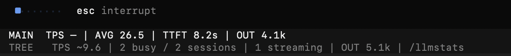
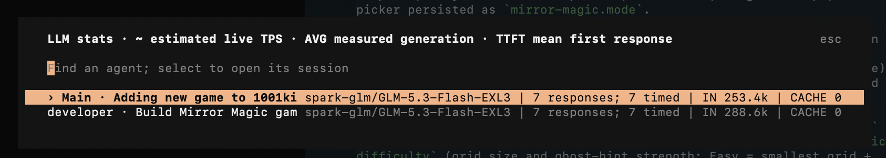

# OpenCode TPS — LLM Performance Stats for Agents and Subagents

OpenCode TPS is an agent-aware TUI plugin for monitoring live LLM performance in OpenCode. It displays tokens per second (TPS), average generation speed, time to first token (TTFT), output-token usage, and combined statistics for main sessions and subagents.

Track model speed while an agent is streaming, compare activity across an entire agent tree, and inspect per-session metrics without leaving the OpenCode terminal interface.

## OpenCode LLM performance monitoring

- Footer in every session: live estimated TPS, measured average generation rate, TTFT, and output tokens.
- `TREE` line aggregating the selected session and all descendant agents.
- Background history loading, so agents are measured even when their view is not open.
- `/llmstats` dialog with each session's agent, model, status, token counts, and timing.
- Tool execution time excluded from generation averages.
- Safe handling of duplicate events, retries, errors, stale streams, and parallel agents.

`TPS` is prefixed with `~` while streaming because OpenCode exposes text deltas, not exact live token counts. Completed `AVG` uses provider-reported output plus reasoning tokens over persisted text/reasoning spans.

### Metrics

- **TPS:** Estimated live output tokens generated per second.
- **AVG:** Measured average generation speed for completed responses.
- **TTFT:** Mean time to first token, showing how quickly the LLM begins responding.
- **OUT:** Output and reasoning-token usage for the current session or agent tree.

OpenCode TPS works with multi-agent workflows, parallel subagents, and sequential agent handoffs. The persistent footer makes model-server performance visible when you switch between a parent session and its child agents.

## Screenshots

### Session footer

Stats for the current session and live activity across its agent tree.



### Agent details

Use `/llmstats` to inspect agents and select a session to open.



## Install the OpenCode TPS plugin

OpenCode TPS uses the [OpenCode plugin system](https://opencode.ai/docs/plugins/) and exposes the required `./tui` package entry point.

### Install with OpenCode

Install the plugin globally from GitHub:

```bash
opencode plugin --global github:cguldogan/opencode-tps
```

OpenCode detects the TUI target, installs the package, and adds `github:cguldogan/opencode-tps` to `~/.config/opencode/tui.json`. Restart OpenCode after installation, then type `/llmstats` to open the detailed agent view.

### Configure manually

Clone the repository:

```bash
git clone git@github.com:cguldogan/opencode-tps.git ~/.config/opencode/tui-plugins/opencode-tps
```

Add its TUI entry point to `~/.config/opencode/tui.json`:

```json
{
  "$schema": "https://opencode.ai/tui.json",
  "plugin": [
    "file:///home/you/.config/opencode/tui-plugins/opencode-tps/tui.tsx"
  ]
}
```

Replace `/home/you` with your home-directory path and restart OpenCode.

## Why use OpenCode TPS?

Use the plugin to diagnose slow LLM responses, observe first-token latency, compare generation speeds, monitor concurrent agents, and understand token usage during OpenCode coding sessions. All statistics are calculated locally from OpenCode session events and history; the plugin does not send analytics or session data to third parties.

## Development

```bash
npm install
npm test
npm run typecheck
```
